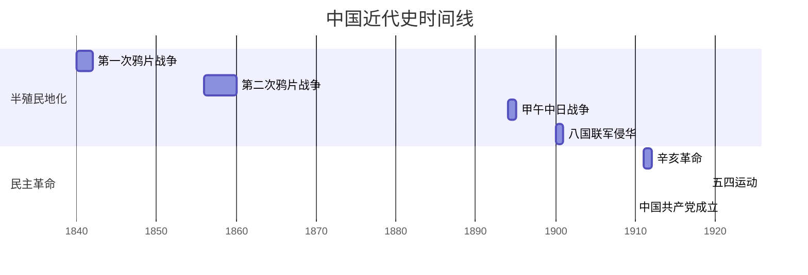

# 中国近代史纲要

<!-- ## 导言
> 中国近现代史，是指1840年以来的中国历史。其中，从鸦片战争爆发到1949年中华人民共和国成立前夕的历史，是**中国近代史**；1949年中华人民共和国成立以来的历史，是**中国现代史**。
1. **中国近代史综述**
    - 当欧美一些国家从17世纪中叶开始确立资本主义生产方式，从18世纪60年代开始工业革命的时候，中国最后一个封建王朝-清朝的统治者却夜郎自大、自我封闭、拒绝扩大与外国交往。
    - **鸦片战争到五四运动前夜**
        - **1842年8月29日**，清政府与英国签订中国近代史上第一个不平等条约-**《南京条约》**
        - 鸦片战争以后，中国逐步成为**半殖民地半封建社会**。从鸦片战争开始，到1949年中华人民共和国成立前，中国都属于半殖民地半封建社会。
        - 半殖民地半封建社会性质，**决定**了近代中国社会矛盾呈现错综复杂的状况。其中**主要矛盾**是**帝国主义和中华民族的矛盾**、**封建主义和人民大众的矛盾**。
        - 近代中国的反侵略战争失败的**根本原因**，正如毛泽东所说：“一是社会制度腐败，二是经济技术落后。”
    - **从五四运动到中华人民共和国成立**
        - 在1949年新中国成立前，中国人民继续遭受帝国主义、封建主义的压迫，后来又增加官僚资本主义的压迫。（**三座大山**）
        - 三种主要的建国方案：
            - 先由北洋军阀后由国民党统治集团代表，主张实行大地主大资本阶级专政，使中国社会继续偶半殖民地半封建的道路
            - 由某些中间派别或中间人士代表，主张建立资本阶级共和国，使中国社会走上独立发展资本主义的道路。
            - 由中国共产党代表，主张建立工人阶级领导的以工农联盟为基础的人民共和国，走经过新民主主义逐步到达社会主义和共产主义的道路。
            - 第一种方案被中国人民抛弃；第二种方案没有得到中国人民的赞同；第三种方案**最终赢得中国最广大人民群众包括民族资产阶级及其统治代表在内的拥护**。
            - 由此可见，中国人民接受中国共产党的领导，接受由新民主主义到社会主义的发展道路，是**郑重做出的历史性选择，具有历史必然性**。
2. 中国现代史综述
    - 社会主义革命和建设时期
    - 改革开放和社会主义现代化建设新时期
    - 中国特色社会主义进入新时代
3. 学习中国近现代史的目的和要求

## 第一章 进入近代后中华民族的磨难和抗争
### 鸦片战争前后的中国和世界
1. **中国封建社会的衰弱**
    - **经济**：以个体家庭位单位并于家庭手工业牢固结合的小农经济是中国封建社会的基本生产结构，自给自足的自然经济占主要地位。
    - **政治**：中国封建社会政治的基本特征是实行高度中央集权的封建君主专制制度
    - **文化**：自汉武帝确立的独尊儒术的政策，儒家思想开始成为中国封建社会的正统思想，儒家还与佛教、道教相互吸收、融合，共同为维护封建统治服务。封建统治者同时吸收法家思想，推行严刑峻法，实行专制统治。
    - **社会**：中国封建社会的社会结构特点是族权和政权相结合的封建宗法等级制度。其和兴是宗族家长制，突出君权、父权、夫权。
    - 中国封建社会的经济、政治、文化、社会结构，**一方面巩固和维系了中国封建社会的稳定和延续，另一方面也使其前进缓慢甚至迟滞，并造成不可克服的周期性政治经济危机**。
    - **17世纪下半叶至18世纪**，这个时期，工业革命在欧洲爆发，就经济社会发展而言，中国已经落后于西方资本主义国家。
2. **世界资本主义的发展和殖民扩张**
    - **1640年的英国资产阶级革命标志着世界历史开始进入资本主义时代**。
    - 18世纪中叶至19世纪中叶，工业革命从英国开始然后迅速推广到欧美各国。
3. **鸦片战争的爆发**
    1. **鸦片战争**
        - 英国对华贸易长期处于**入超**状态，英国工业品遭到中国自然经济和闭关政策的顽强抵抗。
        - 1825年和1837年英国发生了两次资本主义经济危机。为了摆脱危机和转移国内人民的实现，英国正负迫不及待地要发动一场侵略战争。
        - 1842年8月29日，《南京条约》签订。1843年10月，中英签订《虎门条约》。1844年7月，中美签订《望厦条约》
    2. **近代中国社会的半殖民地半封建性质**
        - 从近代中国的历史进程，可以看到中国半殖民地半封建社会有以下一些基本特征
            1. 资本-帝国主义侵略实例不但逐步操控了中国的财政和经济命脉，而且逐步控制了中国的政治，日益成为支配中国的决定性力量。
            2. 中国的封建势力日益衰败并同外国侵略势力勾结，成为资本-帝国主义压迫、奴役中国人民的社会基础和统治支柱。
            3. 中国自然经济的基础虽然遭到破会啊，但是封建剥削制度的根基即封建地主的土地所有制依然在广大地区内保持着，成为中国发展进步的严重障碍。
            4. 中国新兴的民族资本主义经济虽然已经产生，并在政治经济、文化生活中起了一定作用，但在帝国主义和封建主义的压迫下，它的发展很缓慢，力量很软弱，而且它的大部分与外国资本-帝国主义和本国封建主义都有或多或少的联系。
            5. 由于近代中国处于资本-帝国主义列强的争夺和间接统治之下，加上中国地域广大，以及在地方性的农业经济的基础上形成的地方割据势力的存在，近代中国各地区经济、政治和文化的发展是极不平衡的。后来，帝国主义列强还分别支持不同的政治势力以分裂中国，使中国处于不统一状态。
            6. 在资本-帝国主义和封建主义的双重压迫下，中国的广大人民尤其是农民日益贫困化以至大批地破产，过着饥寒交迫和毫无政治权利的生活。
        3. **近代中国社会阶级关系的变动**
            - 不仅旧的阶级发生了变化，还要新的阶级产生
            - 旧的封建统治阶级即地主阶级继续占有大量的土地，有些地主从乡村迁往城市变成城居地主
            - 大多数地主仍主要依靠地租剥削生活，一些城居地主往往兼营土地、高利贷和工商业
            - 农民阶级，仍是近代中国社会人数最多的被剥削阶级
            - **中国工人阶级最早出现于19世纪40至50年代外国资本主义在华企业中。因此，它是先于中国的资产阶级而产生的**。 -->

# 重点梳理
## 第一章 进入近代后中华民族的磨难和抗＋
1. 封建社会的衰落
    1. 经济：小农经济、土地所有制
    2. 政治：皇权封建君主专制制度
    3. 文化：独尊儒术、法家严刑峻法
    4. 社会：族权+政权、核心是宗族家长制
2. 鸦片战争
    1. 原因：
        1. 长期入超
        2. 1825和1837年经济危机
        3. 长期蓄谋作战已久
    2. 中国近代史的起点
        1. 社会性质变化
        2. 帝国主义和中华民族矛盾成为主要矛盾
        3. 新的生产关系、新的阶级和新的思想
3. 近代中国的主要矛盾
    1. 帝国主义和中华民族的矛盾(主要矛盾)
    2. 封建主义和人民大众的矛盾
4. 半殖民地半封建的基本特征
    1. 资本-帝国主义操纵经济命脉和政治
    2. 封建势力和侵略势力勾结，奴役人民
    3. 自然经济破坏，但土地所有制仍保持，严重影响现代化
    4. 民族资产阶级产生但弱小，依附于帝国主义
    5. 政治势力不统一、常常割据
    6. 广大人民饥寒交迫，毫无政治权利
5. 两大历史任务
    1. 争取民族独立、人民解放
    2. 实现国家富强、人民幸福
    3. 相互区别又紧密联系，互为目标前提
6. 西方的侵略
    1. 军事
        1. 发动侵略战争，屠杀中国人民
        2. 侵占中国领土，划分势力范围
        3. 勒索赔款，抢掠财富
    2. 政治
        1. 控制内政，外交
        2. 镇压人民
        3. 扶持收买代理人
    3. 经济
        1. 控制通商口岸
        2. 实行商品倾销和资本输出
        3. 操控中国的经济命脉
    4. 文化
        1. 披着宗教外衣进行侵略
        2. 为侵略制造舆论(奴化)
7. 相关条约

| 时间 | 战争/事件 | 列强 | 条约名称 | 条约要点 |
|------|-----------|------|----------|----------|
| 1840年6月 | 鸦片战争 | 英国 | 中英《南京条约》 | 1. 割让香港岛 2. 赔款2100万元 3. 开放广州、厦门、福州、宁波、上海五处通商口岸（五口通商） 4. 英商进出口货物的税率，中国需与英国商议 |
| 1844年7月 | - | 美国 | 中美《望厦条约》 | 扩大领事裁判权 |
| 1844年10月 | - | 法国 | 中法《黄埔条约》 | 协定关税 |
| 1856年 | 第二次鸦片战争 | 英法 | - | - |
| 1858年 | - | 美英法俄 | 《天津条约》 | 允许外国公使常驻北京 |
| 1858年 | - | 俄国 | 中俄《瑷珲条约》 | 1. 黑龙江以北、外兴安岭以南60多万平方公里的中国领土划归俄国 2. 乌苏里江以东的中国领土划为中俄共管 3. 原属中国内河的黑龙江和乌苏里江只准中、俄两国船只航行 |
| 1860年 | - | 英法俄 | 《北京条约》 | 中英、中法、中俄三个不同条约 |
| 1860年 | 火烧圆明园 | 英法 | - | - |
| 1894年 | 甲午战争 | 日本 | 中日《马关条约》 | 1. 割辽东半岛、台湾及其附属岛屿、澎湖列岛给日本 2. 赔偿日本军费2亿两白银 3. 开放沙市、重庆、苏州、杭州为商埠 4. 日本可以在华通商口岸投资设厂，产品运销中国内地免收内地税 |
| 1900年 | 八国联军侵华 | 八国联军 | 《辛丑条约》 | 1. 清政府赔款白银4.5亿两 2. 保证严禁人民反对外国侵略 3. 拆毁大沽炮台，允许帝国主义国家派兵驻扎北京到山海关铁路沿线重要地区 4. 划北京东交民巷为"使馆界"，允许各国驻兵保护，不准中国人居住 |
8. 反侵略战争失败的原因
    1. 社会制度的腐败
    2. 经济技术的落后
9. 民族意识的觉醒
    1. 师夷长技以制夷
        1. 林则徐
            1. 《四洲志》
        2. 魏源
            1. 《海国图志》
    2. 救亡图存和振兴中华
        1. 康有为
        2. 严复
            1. 《天演论》
## 第二章 不同社会力量堆国家出路的早期探索
1. 太平天国运动
    1. 《天朝田亩制度》
        1. 一个以解决土地问题为中心的比较完整的社会改革方案
        2. 否定了封建社会土地所有制，体现农民平分土地的强烈愿望
        3. 没能超出农民阶级狭隘眼界，不切实际又不具备进步
    2. 《资政新篇》
        1. 具资本主义色彩的方案
        2. 限于历史条件未能付诸实践
    3. 失败的原因
        1. 农民阶级不是新生产力的代表，无法克服阶级局限性，缺乏科学思想理论
        2. 无法制止和客服腐败现象
        3. 军事战略上的重大失误
        4. 以宗教发动的局限性
        5. 未能正确对待儒学，排斥又原封不动地保留
        6. 对侵略者缺乏理性认知
    4. 教训
        1. 农民具有革命潜力，但自身不能完成使命
        2. 单纯的农民战争不可能完成
2. 洋务运动
    1. 成果
        1. 兴办近代企业
        2. 建立新式海陆军
        3. 创办新式学堂，派遣留学生
    2. 历史作用
        1. 客观上对早期工业和民族资产阶级起到促进
        2. 近代教育的开始，使人们开阔眼界
        3. 有利于资本主义经济
        4. 有利于社会风气的改变
    3. 失败的原因
        1. 具有封建性
        2. 对列强有依赖性
        3. 管理腐朽性
3. 戊戌维新变法
    1. 论战
        1. 变法与否
        2. 民权与否
        3. 西学与否
    2. 历史意义
        1. 爱国救亡运动，推动民族觉醒
        2. 资产性质改良运动，冲击封建
        3. 思想启蒙运动，推动近代教育 
    3. 失败的原因
        1. 不敢否定封建主义，“托古改制”
        2. 对帝国主义抱有幻想
        3. 惧怕人民，脱离群众
    4. 教训
        1. 旧中国走改良行不通
## 第三章 辛亥革命与君主专制制度的终结
1. 辛亥革命
    1. 历史条件
        1. 民族危机加深
        2. 清末“新政”破产
        3. 资产阶级革命派扩张
    2. 三民主义的提出
        1. 政治纲领：“驱除鞑虏，恢复中华，创立民国，平均地权” 
        2. 民族主义
        3. 民权主义
        4. 民生主义
    3. 论战
        1. 要不要以革命手段推翻清王朝
        2. 要不要推翻帝制
        3. 要不要社会革命（平均地权）
    4. 过程
        1. 1911年10月   武昌首义
        2. 1912年2月    清帝退位
        3. 1912年1月    成立中华民国临时政府
    5. 《临时约法》
        1. 第一部具有资产阶级共和国宪法性质的法典
    6. 历史意义
        1. 推翻清王朝，沉重打击中外反动势力
        2. 结束封建君主专制
        3. 推动思想解放
        4. 推动社会变革
        5. 推动国际民族解放运动高涨
    7. 失败的原因
        1. 根本上说，是因为资本主义建国行不通
        2. 主观原因（软弱妥协性）
            1. 没有提出彻底的反帝反封建革命纲领
            2. 不能重复发动和依靠人民群众
            3. 不能建立坚强的革命政党
## 第四章 中国共产党成立和中国革命新局面
1. 新文化运动
    1. 历史意义
        1. 改造国民性的启蒙运动
        2. 掀起思想解放潮流
    2. 五四以前的局限
        1. 过度批判孔学
        2. 脱离封建环境的革命实践
        3. 还没有批判精神，过于极端绝对
    3. 发展（五四与十月革命后）
        1. 接受马克思主义，继承五四精神，发扬新民主与新科学
        2. 马克思主义传播，有力推动启蒙运动/从少数人的思想批判到人民群众的革命实践
2. 五四运动
    1. 历史条件
        1. 资产和工人阶级社会力量的成长
        2. 新文化运动掀起的思想解放潮流
        3. 俄国十月革命
        4. 巴黎和会上中国外交的失败
    2. 意义
        1. 彻底反帝反封建的革命性，进步性，是民主主义革命的开端
        2. 促进马克思主义传播与工人运动结合，为中国共产党成立做思想上干部上的准备
        3. 孕育了五四精神，核心是爱国主义
        4. 第一次全面觉醒，人民大众的斗争
3. 马克思主义思想运动
    1. 南陈北李
    2. 重视理论学习
    3. 明确与第二国际划分界限
    4. 注重中国的实际
    5. 开始提出与劳动群众结合的思想
4. 中国共产党早期组织
    1. 研究宣传马克思主义，研究中国实际问题
    2. 到工人中宣传和组织工作
    3. 进行关于建党问题的讨论和实际组织工作
5. 中国共产党的成立
    1. 历史特点
        1. 具有完整的科学世界观和社会革命论的马克思主义
        2. 半殖民地半封建中国的工人运动基础
        3. 工人阶级深受三座大山压迫，有坚强革命性
    2. 历史意义
        1. 中华民族发展史上开天辟地的大事变
        2. 改变中华民族发展方向和进程
        3. 改变中国人民和中华民族的前途和命运
        4. 改变世界发展的趋势和格局
    3. 最低纲领和最高纲领
        1. 最低：打倒列强，推翻国际帝国主义；统一中国成为真正的民主共和国
        2. 最高：实现社会主义、共产主义
    4. 中国革命的新局面
        1. 第一次提出反帝反封建的民主革命纲领
        2. 发动工农群众革命斗争
6. 国共合作（1924.1）
    1. 政治基础
        1. 新三民主义与中共革命阶段纲领基本一致
7. 大革命
    1. 中国共产党的作用
        1. 提出反帝反军阀的口号
        2. 组织国共合作的统一战线
        3. 发动广泛深刻的群众运动
        4. 推动革命军建立与素质政治工作
        5. 直接领导第四军团
    2. 失败的原因
        1. 反革命力量强大
        2. 中国共产党还处在幼年，缺乏应对复杂环境的政治经验，缺乏对中国社会和中国革命基本问题的深刻认识
        3. 后期犯了右倾机会主义错误，放弃领导权，尤其是对武装力量的领导权
    3. 教训
        1. 不但要建立革命统一战线，还要确保自身独立性
        2. 必须坚持武装斗争
        3. 必须解决农民土地问题，充分发挥农民参加革命
        4. 必须加强自身建设
## 第五章 中国革命的新道路
1. 国民的恐怖统治
    1. 建立庞大的军队和特务系统
    2. 保甲制度控制革命活动
    3. 文化专制主义，剥夺言论和出版自由
2. 革命道路的探索
    1. 八七会议-1927.8 
        1. 确定土地革命和武装起义的方针
        2. 由大革命失败到土地革命兴起的历史性转变
    2. 三大起义的时间
        2. 南昌起义-1927.8
        3. 秋收起义-1927.9
        4. 广州起义-1927.12
    3. 农村根据地建设
        1. 依靠贫农
        2. 联合中农
        3. 限制富农
        4. 消灭地主阶级
    4. 左倾错误
        1. 浓厚的左倾情绪没有得到认真清理
        2. 共产国际的错误指导
        3. 马克思理论准备不足，缺乏实践经验
        4. 不能把中国实际全面正确结合
3. 革命在曲折中前进
    1. 第五次反围剿失败与长征
    2. 遵义会议
        1. 确立了毛泽东的领导地位，在最危急关头挽救了党
        2. 确立党中央正确领导，创造性地制定实践符合中国革命的战略
        3. 开启了独立自主解决中国革命实际问题的新阶段
    3. 长征的意义
        1. 保留有生力量
        2. 使国民党将共产党绞杀在摇篮中的图谋失败
        3. 是挫折走向胜利的历史转折
        4. 铸就长征精神
        5. 宣传红色思想
## 第六章 中华民族的抗日战争
1. 抗日民族统一展现的建立
    1. 历史背景
        1. 北平学生一二九运动
        2. 中国共产党提出八一宣言
        3. 西安事变及其和平解决
        4. 国民党五届三中全会
2. 抗战进程
    1. 1931.9   九一八事变  日本占领东北
    2. 1937.7   七七事变    日本全面侵华开始
    3. 1936.12  西安事变    
    4. 1937.9   国共合作正式开始，抗日民族统一战线形成
    5. 1938.10  广州、武汉失守，进入战略防御阶段
    6. 1939.1   国民党五届五中全会，转为消极抗战
    7. 1945.8   日本投降
3. 抗日战争的中流砥柱-中国共产党
    1. 全面抗战路线
    2. 持久战略总方针
    3. 敌后战场的开辟
    4. 游击战术
    5. 独立自主原则
    6. 坚持抗战、团结
    7. 巩固抗日民族统一战线
4. 抗日民主根据地的建设
    1. 三三制
        1. 加强政权建设
        2. 团结各阶级、阶层
        3. 普遍采用民主集中制
    2. 减租减息，发展生产
        1. 停止打土豪分田地，团结地主阶级
        2. 减租减息，减轻农民所受压迫
        3. 帮助农民修水利，改良耕作技术
        4. 开展军民大生产
        5. 厉行精兵简政
    3. 文化教育与干部教育
5. 大后方运动工作
    1. 抗日民主运动开展
    2. 抗日文化工作开展
6. 党的自身建设
    1. 马克思中国化明确提出
    2. 新民主主义理论的系统阐明
    3. 整风运动
    4. 毛泽东思想指导地位的确立
7. 抗日战争的胜利
    1. 原因
        1. 爱国主义为核心的民族精神是决定性因素
        2. 中国共产党的中流砥柱作用是关键
        3. 全民族抗战是制胜法宝
        4. 国际反法西斯力量的支持
    2. 意义
        1. 彻底粉碎日本军国主义的图谋
        2. 促进中华民族的大团结
        3. 对世界各国反法西斯战争产生巨大影响
        4. 坚定中国人民追求民族独立、自由、解放的意志
        
