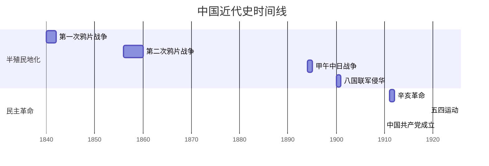
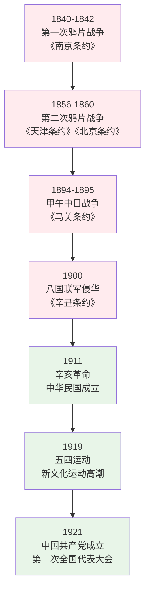

# 中国近代史纲要

```mermaid
gantt
    title 中国近代史时间线
    dateFormat YYYY
    axisFormat %Y
    
    section 半殖民地化
    第一次鸦片战争     :1840, 1842
    第二次鸦片战争     :1856, 1860
    甲午中日战争       :1894, 1895
    八国联军侵华       :1900, 1901
    
    section 民主革命
    辛亥革命           :1911, 1912
    五四运动           :1919, 1919
    中国共产党成立     :1921, 1921
```

```mermaid
flowchart TD
    A["1840-1842<br/>第一次鸦片战争<br/>《南京条约》"] --> B["1856-1860<br/>第二次鸦片战争<br/>《天津条约》《北京条约》"]
    B --> C["1894-1895<br/>甲午中日战争<br/>《马关条约》"]
    C --> D["1900<br/>八国联军侵华<br/>《辛丑条约》"]
    D --> E["1911<br/>辛亥革命<br/>中华民国成立"]
    E --> F["1919<br/>五四运动<br/>新文化运动高潮"]
    F --> G["1921<br/>中国共产党成立<br/>第一次全国代表大会"]
    
    style A fill:#ffebee
    style B fill:#ffebee
    style C fill:#ffebee
    style D fill:#ffebee
    style E fill:#e8f5e8
    style F fill:#e8f5e8
    style G fill:#e8f5e8
```